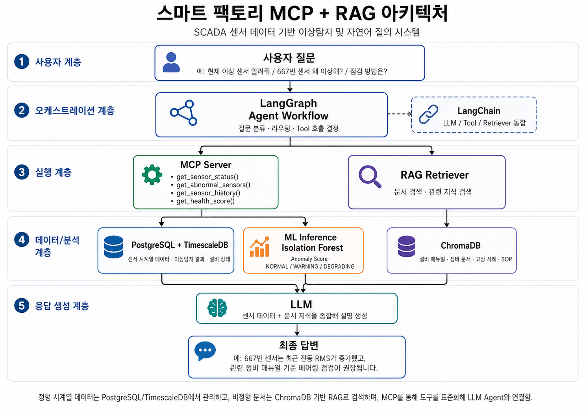

# Smart Factory MCP · Tool-Calling AI Agent

2019년 자동차 용접 생산라인 SCADA 데이터로 이상 후보를 탐지하고, TimescaleDB의 센서 결과와 ChromaDB의 점검 지식을 MCP Tool을 통해 조회하는 스마트 팩토리 AI Agent 프로젝트입니다.

이 프로젝트의 핵심은 LLM이 DB에 직접 접근하거나 미리 고정된 경로만 실행하지 않는다는 점입니다. LangGraph Agent가 사용자 질문과 이전 Tool 결과를 관찰하면서 read-only MCP, 로컬 RAG, 조건부 Web 검색 중 필요한 기능을 선택합니다.

> 모든 센서 값은 2019년 historical dataset의 저장값입니다. Risk Score는 고장 확률이 아니며 실제 설비 판단에는 현장 안전 규정과 제조사 매뉴얼을 우선해야 합니다.



## 주요 기능

- 센서 `84`, `92`, `109`의 1분 Feature와 이상탐지 결과 관리
- 3-Sigma Baseline과 Isolation Forest 기반 Risk Score 산출
- TimescaleDB/PostgreSQL 조회를 MCP stdio Tool 7개로 표준화
- ChromaDB 기반 점검 지식 검색과 citation 제공
- Gemini Tool-Calling Agent의 동적 multi-step 실행
- 사용자 명시적 요청에만 허용되는 Tavily Web 검색
- Tool 이름·인자·상태·결과 요약을 보여주는 Agent Execution Dashboard
- API 키가 없어도 동작하는 deterministic offline fallback

## 처리 구조

```text
사용자 질문
    ↓
LangGraph Tool-Calling Agent
    ├─ MCP Sensor Tools → MCP stdio → SensorRepository → TimescaleDB
    ├─ RAG Tool          → LangChain Retriever → ChromaDB
    └─ Web Tool          → Tavily (명시적 요청만)
             ↑
         ToolMessage
             └──────────→ Agent 재판단 → Final Answer
```

## 프로젝트 진행 단계

| Part | 내용 | 문서 |
|---|---|---|
| 1 | 6개월 SCADA EDA, 센서 선정, TimescaleDB 적재 | [Part 1](docs/part1/README.md) |
| 2 | 3-Sigma, Isolation Forest, Risk Score | [Part 2](docs/part2/README.md) |
| 3 | Flask REST API와 read-only MCP Tool 7개 | [Part 3](docs/part3/README.md) |
| 4 | ChromaDB RAG와 고정 LangGraph Router | [Part 4](docs/part4/README.md) |
| 5 | Tool-Calling Agent와 실행 추적 Dashboard | [Part 5](docs/part5/README.md) |

전체 블로그 원고와 재현 Runbook은 [docs/README.md](docs/README.md)에서 확인할 수 있습니다.

## 빠른 시작

### 1. 환경 구성

```bash
python -m venv .venv
source .venv/bin/activate
python -m pip install -r requirements-part4.txt
cp .env.example .env
```

`.env`의 PostgreSQL 설정을 변경하고, Gemini/Tavily 온라인 기능을 사용할 때만 해당 API 키를 입력합니다. `.env`는 Git에 포함되지 않습니다.

### 2. TimescaleDB 실행

```bash
docker compose up -d
```

처음부터 데이터를 구축하려면 [Part 1 Runbook](docs/part1/eda_to_timescaledb_runbook.md)과 [Part 2 Runbook](docs/part2/anomaly_detection_runbook.md)을 순서대로 실행합니다. 원본 SCADA CSV, 처리된 Parquet, 학습 모델과 DB 백업은 저장소에 포함되지 않습니다.

### 3. 지식 인덱스 생성

```bash
python scripts/index_knowledge.py
```

### 4. Dashboard 실행

```bash
python -m web_app.app
```

브라우저에서 `http://127.0.0.1:5000/`을 엽니다.

## 검증

```bash
python scripts/mcp_smoke_test.py
python scripts/flask_smoke_test.py
python scripts/part5_agent_mocked_test.py
python scripts/part5_agent_smoke_test.py
python scripts/part5_dashboard_test.py
```

실제 Gemini와 Tavily 테스트는 센서 결과와 검색 문서 일부를 외부 서비스로 전송합니다. 데이터 반출이 허용된 환경에서만 다음 명령을 실행합니다.

```bash
python scripts/part5_agent_online_smoke_test.py
```

## MCP Tool

| Tool | 용도 |
|---|---|
| `list_monitored_sensors` | 모델에 포함된 센서와 마지막 저장 상태 |
| `get_model_summary` | 모델 metadata와 historical data 범위 |
| `get_sensor_status` | 센서의 마지막 저장 상태와 Feature |
| `get_abnormal_sensors` | 지정 상태 이상인 센서 목록 |
| `get_sensor_history` | 마지막 저장 시점 기준 historical window |
| `get_anomaly_detail` | 특정 anomaly window 상세 |
| `get_factory_summary` | 센서 상태별 공장 집계 |

## 저장소 구조

```text
smartfactory_mcp/
├─ mcp_server/   MCP Server, Client, read-only Repository
├─ rag/          Part 4 Router와 Part 5 Tool-Calling Agent
├─ web_app/      Flask API와 Agent Execution Dashboard
├─ scripts/      EDA 이후 데이터·ML·RAG·회귀 테스트 실행 파일
├─ sql/          TimescaleDB extension과 table schema
├─ knowledge/    로컬 RAG 데모 점검 문서
├─ docs/         Part 1~5 블로그 원고와 Runbook
├─ data/         Git에서 제외되는 처리 데이터 안내
└─ models/       Git에서 제외되는 학습 모델 안내
```

각 폴더의 세부 역할과 실행 진입점은 해당 폴더의 `README.md`에 정리되어 있습니다.

## 데이터와 보안

다음 항목은 `.gitignore`로 제외됩니다.

- `.env`, API 키, 인증서와 credential 파일
- 9GB 이상의 원본 `SCADA/` CSV와 압축 파일
- Parquet 처리 데이터와 ChromaDB 인덱스
- Isolation Forest `joblib` 모델
- PostgreSQL dump와 로컬 캐시
- IDE 및 AI coding-agent 로컬 설정

공개 가능한 EDA/모델 평가 스냅샷만 `docs/part1/results`, `docs/part2/results`, `docs/part1/images`, `docs/part2/images`에 보관합니다.

## 현재 범위

- Ground truth 고장 label이 없는 비지도 이상탐지 프로젝트입니다.
- 센서 ID와 실제 설비 부품 위치의 매핑은 포함되어 있지 않습니다.
- MCP와 Dashboard는 historical 결과 조회만 제공하며 PLC 제어와 DB 쓰기를 수행하지 않습니다.
- `knowledge/` 문서는 RAG 검증용 일반 가이드이며 제조사 정비 문서가 아닙니다.
