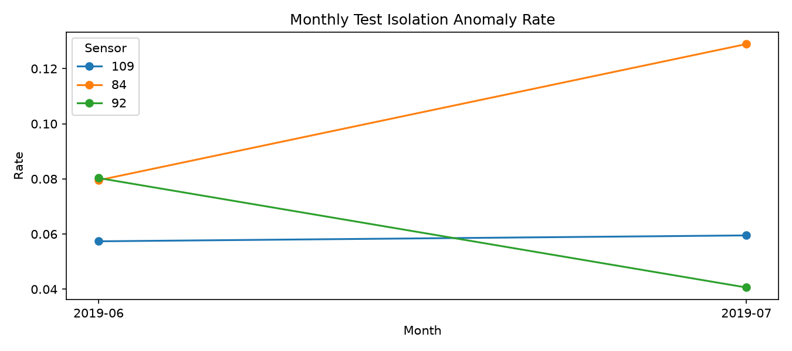
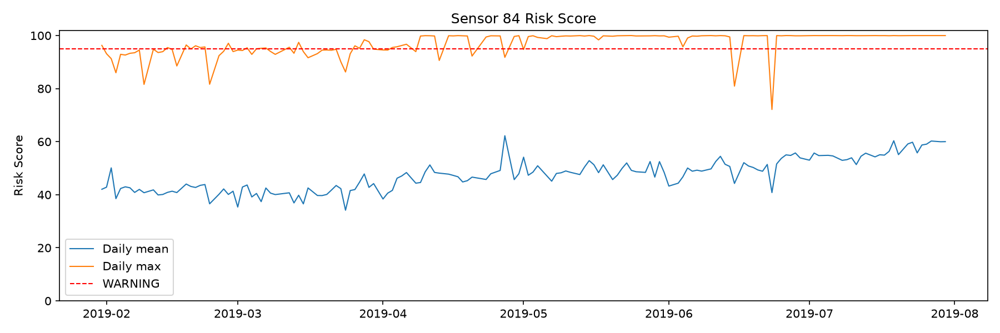
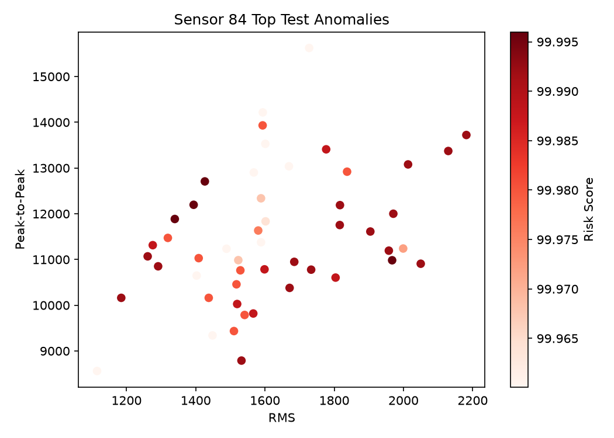
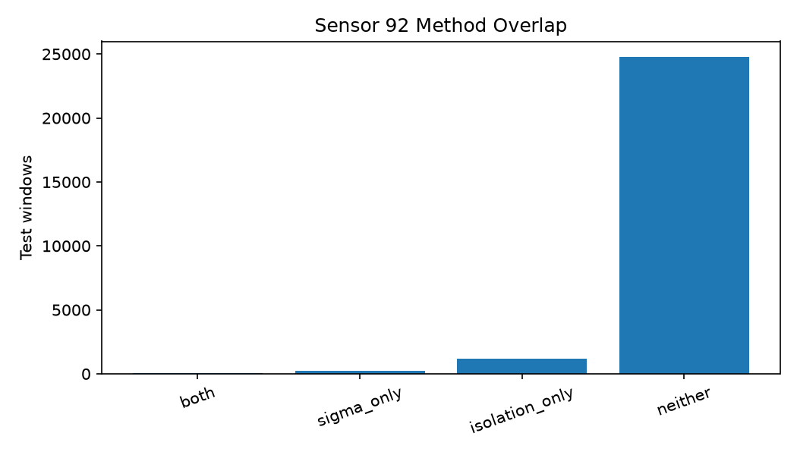

# [Smart Factory MCP #2] 라벨 없는 SCADA 데이터에서 이상을 찾는 방법: 3-Sigma와 Isolation Forest

> 이 글은 스마트 팩토리 SCADA 이상탐지 + MCP 프로젝트의 Part 2다.  
> Part 1에서 정리한 1분 Feature를 이용해 센서별 이상 점수를 만들고 TimescaleDB에 저장한다.

## 들어가며

Part 1에서는 31GB SCADA 데이터 중 연속 6개월을 분석하고 센서 `92`, `109`, `84`를 선정했다.

```text
선정 센서 원시값       33,244,953행
1분 Feature             387,741행
원시값 Hypertable       sensor_reading
Feature Hypertable      sensor_feature_1min
```

이번 단계의 문제는 명확한 고장 라벨이 없다는 점이다. 따라서 특정 모델의 예측을 정답처럼 취급하지 않고, 단순한 통계 기준과 비지도 모델을 비교하면서 반복적으로 이상 후보를 검토한다.

---

## 1. Part 2의 목표

```text
TimescaleDB Feature 조회
→ 센서별 시간 분리
→ 3-Sigma Baseline
→ Isolation Forest
→ Risk Score 변환
→ 상위 이상 구간 시각 검토
→ anomaly_result 적재
```

이 단계에서는 MCP나 RAG를 연결하지 않는다. 이상탐지 결과를 재현 가능한 형태로 생성하고 DB에서 조회할 수 있게 만드는 것까지를 Part 2의 범위로 정했다.

---

## 2. 모델 입력 데이터

초기 모델 Feature는 다음과 같다.

```text
mean
std
min_value
max_value
rms
peak_to_peak
slope
```

`sample_count`는 모델 입력보다 Window 품질 검사에 먼저 사용한다. 관측치가 부족한 Window 자체를 설비 이상으로 학습할 가능성을 줄이기 위해서다. Part 1에서 최소 30개의 관측치가 있는 Window만 생성했다.

주말이나 비가동 구간의 긴 공백은 보간하지 않는다. 존재하지 않는 센서값을 만들어내면 모델이 실제보다 매끄러운 시계열을 학습할 수 있다.

---

## 3. 시간 순서 데이터 분리

시계열 데이터를 무작위로 나누면 미래 패턴이 Train에 섞일 수 있다. 각 센서를 시간순으로 정렬하고 다음 비율로 분리한다.

```text
Train         앞 60%
Validation    다음 20%
Test          마지막 20%
```

전처리와 모델 학습은 Train에만 적용하고, Validation은 Risk Score 임계값을 정하는 데 사용한다. Test는 임계값을 고정한 뒤 마지막 평가에만 사용한다.

### 실제 분리 결과

| 센서 | Train 기간·행 수 | Validation 기간·행 수 | Test 기간·행 수 |
|---|---|---|---|
| 92 | 01-31~05-20 · 78,765 | 05-20~06-25 · 26,255 | 06-25~07-30 · 26,255 |
| 109 | 01-31~05-20 · 78,756 | 05-21~06-25 · 26,252 | 06-25~07-30 · 26,252 |
| 84 | 01-31~05-21 · 75,123 | 05-21~06-26 · 25,041 | 06-26~07-30 · 25,042 |

---

## 4. 3-Sigma Baseline

Train 구간에서 Feature별 평균과 표준편차를 계산한다.

```text
lower = mean - 3 × std
upper = mean + 3 × std
```

하나 이상의 Feature가 범위를 벗어나면 3-Sigma 이상 후보로 표시한다. 센서 분포가 정규분포와 다르기 때문에 최종 판단 기준이라기보다 Isolation Forest를 비교하기 위한 Baseline으로 사용한다.

### 3-Sigma 결과

| 센서 | Test Window | 이상 Window | 이상 비율 |
|---|---:|---:|---:|
| 92 | 26,255 | 302 | 1.15% |
| 109 | 26,252 | 1,039 | 3.96% |
| 84 | 25,042 | 3,793 | 15.15% |

---

## 5. Isolation Forest

Isolation Forest는 여러 Feature의 조합에서 다른 관측치와 쉽게 분리되는 Window를 찾는다. 센서마다 값의 범위와 패턴이 다르므로 센서별 모델을 따로 학습한다.

```python
IsolationForest(
    n_estimators=300,
    contamination="auto",
    random_state=42,
    n_jobs=-1,
)
```

`predict()`의 이진 결과만 저장하지 않고 `decision_function()`을 함께 보존한다. 이후 모델의 원본 점수를 운영자가 이해할 수 있는 Risk Score로 변환한다.

---

## 6. Risk Score와 상태 등급

Isolation Forest의 점수 방향을 뒤집어 값이 클수록 더 비정상적인 `severity`를 만든다.

```text
severity = -decision_function(X)
```

Validation severity의 경험적 백분위수를 이용해 `0~100` Risk Score로 변환한다.

| Risk Score | 상태 |
|---:|---|
| 0~59 | NORMAL |
| 60~79 | ATTENTION |
| 80~94 | DEGRADING |
| 95~100 | WARNING |

초기 비교에서는 Validation 95백분위수를 이상 기준, 99백분위수를 강한 이상 기준으로 별도 기록한다. 실제 운영 등급은 결과 분포를 확인한 뒤 조정한다.

---

## 7. 라벨 없는 모델 검증

고장 Ground Truth가 없기 때문에 Accuracy나 F1 Score를 계산하는 것만으로 모델을 평가할 수 없다.

다음 항목을 확인한다.

- 센서별·월별 이상 탐지 비율
- 3-Sigma와 Isolation Forest가 동시에 탐지한 Window
- 한 방법만 탐지한 Window의 특징
- 상위 Risk Score 구간의 실제 Feature 변화
- 수집 공백과 낮은 `sample_count`의 영향
- Train, Validation, Test 사이 점수 분포 변화

### 비교 결과

| 센서 | 3-Sigma 이상 | Isolation Forest 이상 | 공통 이상 | 공통 비율 |
|---|---:|---:|---:|---:|
| 92 | 302 | 1,239 | 42 | IF 기준 3.39% |
| 109 | 1,039 | 1,553 | 456 | IF 기준 29.36% |
| 84 | 3,793 | 3,060 | 3,018 | IF 기준 98.63% |

센서 84는 두 방법의 탐지 결과가 거의 일치했다. 단일 Feature의 극단값뿐 아니라 여러 Feature의 조합도 Train 구간과 달라졌다는 뜻이다. 반대로 센서 92는 Isolation Forest만 탐지한 구간이 많아 데이터 품질과 다변량 패턴을 추가로 확인해야 했다.

### 데이터 품질 영향

| 센서 | 낮은 표본 Window의 IF 이상률 | 나머지 Window | 60분 이상 공백 직후 | 해석 |
|---|---:|---:|---:|---|
| 92 | 14.87% | 3.54% | 12.24% | 표본 수와 공백 영향 주의 |
| 109 | 4.99% | 6.02% | 8.16% | 영향이 제한적 |
| 84 | 3.89% | 13.17% | 0% | 낮은 표본·공백이 주원인은 아님 |

센서 92의 WARNING을 곧바로 설비 이상으로 해석하면 안 된다. 반면 센서 84의 Test 이상률 상승은 낮은 표본 수로 설명되지 않았다. 다만 이것도 고장을 의미하는 것은 아니며, 생산 조건이나 운전 모드 변화일 가능성이 남아 있다.

### 주요 그래프



센서 84의 Isolation Forest 이상률은 6월 7.95%에서 7월 12.89%로 상승했다. 센서 109는 5.74%에서 5.95%로 비슷했고, 센서 92는 8.05%에서 4.05%로 감소했다.







---

## 8. TimescaleDB 저장

모델 실행 정보와 Window별 결과를 분리해 저장한다.

```text
anomaly_model_run
└─ 실행 버전, Feature, 파라미터, 상태 임계값

anomaly_model_sensor
└─ 센서별 학습 기간, 3-Sigma Profile, Validation 임계값

anomaly_result
└─ 센서·Window별 3-Sigma 결과, Isolation 점수, Risk Score, 상태
```

모델 결과를 DB에 저장하면 Part 3의 MCP Tool은 모델을 다시 실행하지 않고 최신 이상 상태와 이력을 SQL로 조회할 수 있다.

### 적재 결과

| 항목 | 결과 |
|---|---|
| Model Run ID | `iforest_2019_02_2019_07_v1` |
| 모델 센서 | 92, 109, 84 |
| Scikit-learn | 1.9.0 |
| 결과 행 수 | 387,741 |
| NORMAL | 243,507 |
| ATTENTION | 72,816 |
| DEGRADING | 54,052 |
| WARNING | 17,366 |
| Test 이상 Window | 5,852 / 77,549 |
| 데이터 시작 시각 | 2019-01-31 00:00:00 |
| 데이터 종료 시각 | 2019-07-30 20:42:00 |
| `anomaly_result` 크기 | 168MB, 7개 Chunk |
| DB 전체 크기 | 8,439MB |

---

## 9. 정리

Part 2의 핵심은 복잡한 모델을 먼저 사용하는 것이 아니라, 라벨이 없는 상황에서도 결과를 비교하고 설명할 수 있는 기준을 만드는 것이다.

```text
시간 순서 분리
→ 단순 Baseline
→ 비지도 모델
→ Validation 기반 점수 보정
→ 시각 검토
→ DB 저장
```

이번 결과는 이상 후보를 찾는 데는 유용했지만, 센서 92처럼 데이터 품질의 영향을 함께 보여줘야 한다는 점도 확인했다. Part 3의 MCP 응답에서는 Risk Score만 반환하지 않고 `sample_count`와 최근 수집 공백을 함께 조회해야 한다.

---

## 다음 편 예고

Part 3에서는 TimescaleDB의 이상탐지 결과를 MCP Tool로 노출한다.

```text
최근 이상 센서 조회
→ 센서 상태 이력 조회
→ Risk Score와 근거 Feature 반환
→ LLM의 자연어 질의와 연결
```
